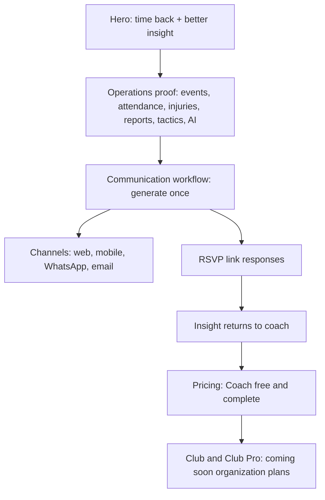

# feat: Reposition website as free coach operations platform

## Summary

Rework the STRIVN landing page so it presents STRIVN as a free, complete operations platform for one-team coaches, with Club and Club Pro as coming-soon organization plans. The implementation should preserve the current calm premium visual system while moving the narrative away from WhatsApp-centric pricing and toward time saved, centralized team information, and channel-agnostic communication.

---

## Problem Frame

The current site is structurally ready for a landing-page repositioning, but its content and several UI assumptions still describe STRIVN as a virtual staff member that runs through WhatsApp and is priced around WhatsApp message allowances. The origin requirements change the product story: Coach is free and complete for one team; communication is a core free workflow; WhatsApp is one channel among web, mobile, WhatsApp, and email; paid value starts when a club wants multi-team coordination.

The implementation should therefore be a focused website refactor, not a product-app billing refactor. It must update the marketing narrative, pricing presentation, demo proof, metadata, and bilingual copy without widening into backend plan enforcement or future mobile app feature marketing.

---

## Requirements

**Positioning and Narrative**

- R1. The website positions STRIVN as a free operations platform for coaches, not a WhatsApp-first product or premium messaging tool.
- R2. The first viewport communicates that STRIVN gives coaches time back and centralizes team information into better insight.
- R3. The page makes complete free Coach adoption visible before pricing, including that coaches can start without club budget approval.
- R4. The page remains credible for clubs by making Club and Club Pro about organization-level coordination.

**Coach Plan and Pricing**

- R5. Coach is shown as free, complete for one team, and inclusive of unlimited players and staff members.
- R6. Core coach features remain visibly included: events, sessions, matches, attendance, injuries, tactics, reports, AI, player management, medical notes, individual programs, communication generation, RSVP links, and templates.
- R7. Pricing removes WhatsApp message allowances, WhatsApp packs, and any customer-facing WhatsApp cost logic.
- R8. Club and Club Pro are shown as coming soon with contact or demo interest capture, not invented fixed prices.

**Communication and RSVP**

- R9. Communication remains a full product section but is reframed around one event communication workflow across channels.
- R10. The communication section explains generated messages, reusable templates or smart defaults, coach-distributed sharing, and RSVP links.
- R11. WhatsApp remains visible only as one available channel alongside web, mobile, and email.
- R12. The product demo shows event creation, communication generation, RSVP collection, and insight returning to the coach.

**Content Quality and Verification**

- R13. The page hierarchy avoids becoming a raw feature checklist; feature breadth supports the time-saved and insight promise.
- R14. French and English content remain equivalent in meaning and CTA direction.
- R15. The design and voice stay aligned with `DESIGN.md` and `PRODUCT.md`.
- R16. The final page builds successfully and is browser-verified across desktop and mobile viewports.

---

## Key Technical Decisions

- **Content data remains the source of truth:** Keep the bilingual message strategy in `src/data/landingContent.ts` so French and English stay parallel and the Astro component remains presentation-focused.
- **Reuse the existing landing component shell:** Modify `src/components/PremiumLanding.astro` in place instead of extracting components first; the current single-page surface is compact enough, and extraction would add refactor risk before the new narrative is proven.
- **Rename the WhatsApp concept at the content/UI level:** Keep the section slot, but change its identity to communication or channels so the page no longer anchors navigation, footer, or section copy on WhatsApp.
- **Replace message-pack pricing with organization tiers:** Adapt the existing plan-card UI for Coach, Club, and Club Pro, and remove the add-on pack UI rather than hiding it behind empty data.
- **Use browser verification as the behavioral test layer:** There is no existing test framework. The implementation should rely on `npm run build` plus browser checks for copy hierarchy, responsive fit, and absence of WhatsApp-centric pricing.

---

## High-Level Technical Design

The page narrative should move from coach pain to operations platform proof, then communication workflow, then complete free adoption, then organization expansion. WhatsApp may appear in the channel branch, but it should not sit on the main path.

---

## Implementation Units

### U1. Reframe Bilingual Content Model

- **Goal:** Update the landing content so both locales express the new positioning, plan model, and channel-agnostic communication story.
- **Requirements:** R1, R2, R3, R5, R6, R9, R10, R11, R12, R14
- **Dependencies:** None
- **Files:**
  - `src/data/landingContent.ts`
  - `PRODUCT.md`
- **Approach:** Rename content fields where needed from WhatsApp-specific concepts to communication/channel concepts. Rewrite hero, navigation, hero demo pane copy, staff/operations pillars, communication section, FAQ, final CTA, footer, and metadata copy in both French and English. Update `PRODUCT.md` to align the documented product purpose with “free operations platform for coaches” and “club expansion path.”
- **Patterns to follow:** Preserve the existing `landingContent` object structure where it still supports the new story; only introduce new content fields when the existing names force misleading semantics.
- **Test scenarios:**
  - French and English metadata no longer describe STRIVN as “all from WhatsApp.”
  - French and English hero copy both lead with time saved and centralized operations insight, not price or WhatsApp.
  - Communication copy in both locales mentions multiple channels and RSVP links.
  - Pricing copy in both locales describes Coach as free and complete and Club tiers as coming soon.
- **Verification:** Review generated page copy in `/fr/` and `/en/` to ensure the messages are equivalent, not literal translations that drift in meaning.

### U2. Refactor Communication Section and Hero Demo

- **Goal:** Turn the dedicated WhatsApp section and hero sequencer into proof of event communication across channels.
- **Requirements:** R9, R10, R11, R12, R13, R14, R15
- **Dependencies:** U1
- **Files:**
  - `src/components/PremiumLanding.astro`
  - `src/data/landingContent.ts`
- **Approach:** Update section IDs, nav labels, comments, icons, phone mockup labels, and copy bindings so the section reads as “Communication” or “Channels,” not WhatsApp. Adjust the hero device panes to show: event/week creation, generated communication, coach distribution or approval, RSVP response, and insight update. Keep WhatsApp as one visual channel, but add web/mobile/email proof through chips, labels, or compact channel controls.
- **Patterns to follow:** Reuse the current `v2-phone`, `v2-pane`, `v2-pills`, and reveal patterns rather than introducing a new design system.
- **Test scenarios:**
  - Covers AE2. A visitor who sees WhatsApp also sees web, mobile, email, or RSVP/copy-forward context in the same section.
  - The hero demo no longer claims direct paid WhatsApp delivery or automated WhatsApp follow-up as the default free model.
  - The section remains visually concrete and scannable after moving away from a single WhatsApp phone mockup.
- **Verification:** Browser-check desktop and mobile views to confirm channel labels and RSVP proof are visible without text overlap.

### U3. Replace Pricing With Coach, Club, and Club Pro

- **Goal:** Remove WhatsApp-centric pricing and present the new plan architecture.
- **Requirements:** R4, R5, R6, R7, R8, R13, R14
- **Dependencies:** U1
- **Files:**
  - `src/components/PremiumLanding.astro`
  - `src/data/landingContent.ts`
- **Approach:** Change the pricing data shape if needed to support three plans, coming-soon badges, and plan-specific CTAs. Remove the add-on packs area from the rendered pricing section. Make Coach visually clear as free and complete; show Club and Club Pro as coming-soon organization plans focused on multi-team administration, shared staff, reporting, analytics, and API access.
- **Patterns to follow:** Reuse the existing plan-card visual language, but revise grid behavior for three cards so desktop and mobile layouts remain stable.
- **Test scenarios:**
  - Covers AE1. Pricing shows Coach as free and complete for one team, with unlimited players and staff.
  - Covers AE3. Club and Club Pro value is organization-level coordination, not unlocking basic coach features.
  - No visible pricing copy includes WhatsApp message counts, message packs, or WhatsApp add-on prices.
  - Club and Club Pro do not display invented fixed prices.
- **Verification:** Browser-check pricing on desktop and mobile; confirm all three plan cards fit without clipped text or uneven layout breaks.

### U4. Tune Page Hierarchy, Footer, and Metadata

- **Goal:** Keep the rebuilt page focused and coherent after the copy and section changes.
- **Requirements:** R1, R2, R3, R13, R14, R15
- **Dependencies:** U1, U2, U3
- **Files:**
  - `src/components/PremiumLanding.astro`
  - `src/data/landingContent.ts`
  - `src/layouts/BaseLayout.astro`
  - `DESIGN.md`
- **Approach:** Update top nav and footer links to match the new section identity. Revise fallback layout metadata if it still conflicts with the new positioning. Update `DESIGN.md` only where the old guidance tells implementers to make WhatsApp central. Reduce or reorganize feature-heavy copy if the page starts reading like a checklist rather than a narrative.
- **Patterns to follow:** Preserve current restrained typography, dark palette, compact controls, and reduced-motion behavior from the existing landing page.
- **Test scenarios:**
  - The nav and footer do not include a product category named only “WhatsApp.”
  - The page still has a clear scan path from hero to operations proof to communication to pricing.
  - French and English footer CTAs both point toward free coach adoption and optional demo/contact.
- **Verification:** Read the page top-to-bottom in both locales and compare against `DESIGN.md` voice constraints.

### U5. Build and Browser Verification

- **Goal:** Verify the static site compiles and the repositioned landing page works visually across key routes and viewports.
- **Requirements:** R14, R15, R16
- **Dependencies:** U1, U2, U3, U4
- **Files:**
  - `package.json`
  - `src/pages/index.astro`
  - `src/pages/fr/index.astro`
  - `src/pages/en/index.astro`
- **Approach:** Use the existing Astro build as the compile check. Start the dev server for browser verification, then inspect `/`, `/fr/`, and `/en/` across desktop and mobile. Verify the hero, communication section, pricing section, FAQ, footer, interactive hero sequencer, and reduced/no-JS fallback state if practical.
- **Patterns to follow:** Use the existing `_shot` static mode for screenshot/no-JS parity checks if browser capture needs stable animation state.
- **Test scenarios:**
  - `npm run build` completes successfully.
  - `/`, `/fr/`, and `/en/` render without console-blocking errors.
  - Desktop viewport shows the new hero promise, channel-agnostic communication section, and three-plan pricing without overlap.
  - Mobile viewport keeps CTA buttons, plan cards, communication proof, and hero demo readable.
  - Search visible text for WhatsApp-message pricing terms and confirm none remain.
- **Verification:** Record the build result and browser findings in the implementation summary; no separate test artifact is required unless failures need tracking.

---

## Scope Boundaries

### Deferred for later

- Fixed Club and Club Pro prices.
- Direct WhatsApp delivery, automated reminders, automated follow-ups, wellness check-ins, and injury check-ins as premium messaging enhancements.
- Detailed mobile app marketing beyond positioning mobile as one communication channel and future preferred channel.
- Technical explanation of RSVP player recognition or persistent device tokens.

### Outside this product identity

- WhatsApp as the product.
- WhatsApp message packs as the monetization model.
- Paywalling the core one-team coach workflow.
- Rebuilding the page as only a medical tool, only a communication tool, or only an analytics dashboard.

### Deferred to Follow-Up Work

- Extracting `PremiumLanding.astro` into smaller Astro components solely for maintainability.
- Adding a full automated browser test suite; this plan uses build plus manual/browser QA because the repo currently has no test harness.
- Implementing backend billing, feature gates, or communication delivery changes outside the website.

---

## System-Wide Impact

This plan changes the public product story and the customer-facing pricing model on the website. It does not change application billing enforcement, backend feature gating, RSVP behavior, or communication delivery mechanics. Any mismatch between the website and the app’s actual billing/feature gates should be treated as a separate product implementation track.

---

## Risks and Dependencies

- **Over-broad feature surface:** Listing every included feature can make the page feel like a checklist. Mitigation: keep feature lists subordinate to the time-saved and insight narrative.
- **WhatsApp still visually dominates:** Reusing the existing phone mockups can accidentally preserve the old product story. Mitigation: add channel proof and RSVP proof wherever WhatsApp appears.
- **Pricing ambiguity:** “Coming soon” tiers can feel vague if not anchored in organization value. Mitigation: make Club and Club Pro benefits specific even without prices.
- **Locale drift:** French and English could diverge in plan semantics. Mitigation: verify both locales against the same requirements, not just translation quality.

---

## Sources and Research

- `docs/brainstorms/2026-06-03-website-free-operations-platform-repositioning-requirements.md` is the origin document for product scope, actors, flows, acceptance examples, and boundaries.
- `src/data/landingContent.ts` is the current bilingual content source and contains the WhatsApp-centric copy and pricing to refactor.
- `src/components/PremiumLanding.astro` renders the current landing sections, pricing UI, animations, and browser behavior.
- `src/layouts/BaseLayout.astro` carries fallback metadata that may need alignment with the new positioning.
- `DESIGN.md` and `PRODUCT.md` define the current brand, voice, and visual constraints to preserve.
- `package.json` provides the existing verification command through `npm run build`.
