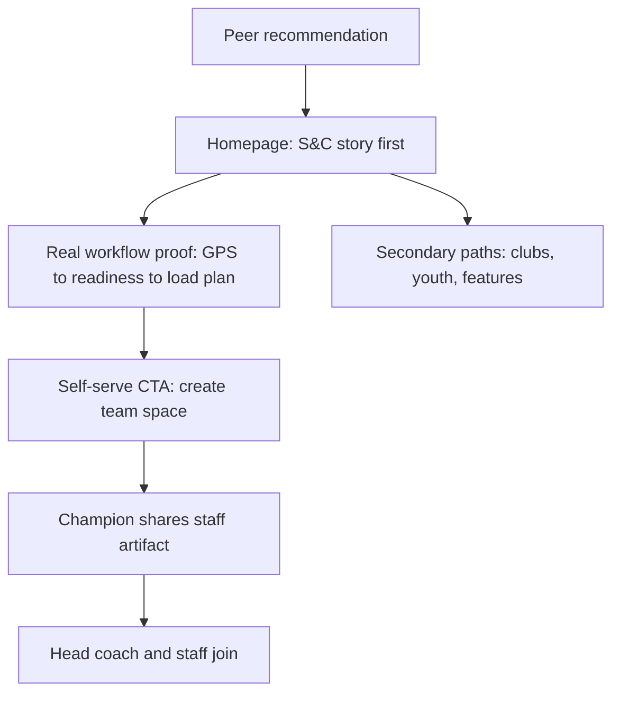

# S&C-First Website Repositioning - Plan

## Goal Capsule

- **Objective:** Reposition the STRIVN marketing site so its front door speaks first to S&C / performance coaches — per-player load, readiness and health monitoring as the lead story, proven by the real product doing the daily workflow — across all six locales.
- **Product authority:** This Product Contract. Brand voice and anti-references per `PRODUCT.md`. The commercial and pricing story is not active scope.
- **Open blockers:** None. Outstanding questions are all deferred to planning.

---

## Product Contract

### Summary

Rework the site's message around the S&C coach as primary audience: the homepage leads with per-player load, readiness and health, shown through the real product performing the daily monitoring workflow, with the relief made explicit — Excel sheets, manual GPS exports and paper wellness questionnaires replaced by one system. Existing audience and feature pages remain as secondary paths, and CTAs keep today's self-serve mechanics.

### Problem Frame

The platform outgrew its website. Recent releases made STRIVN a pro monitoring tool — RPE, GPS import, wellness, load planning, BI — and the users who convert reflect that: across onboarded clubs, roughly 90% of interlocutors are S&C coaches. They request the features, get daily value, and champion adoption across the rest of the staff. Before STRIVN, their toolkit was Excel sheets everywhere, manual GPS exports, and paper wellness questionnaires.

Acquisition is warm: clubs arrive through the founder's network and through S&C coaches recommending STRIVN to peers. The site's real job is to confirm that recommendation. Today it cannot: the homepage still tells the 2026-06 operations story — "Your whole team, under one roof." (`src/data/landingContent.ts`) — and pro monitoring is invisible until the S&C subpage one click deep. A referred S&C coach lands on the site and does not see their work reflected.

### Key Decisions

- **S&C-first homepage, told show-don't-tell.** (session-settled: user-directed — chosen over a role-routed front door and over claim-led messaging: one persona dominates acquisition, and warm referral traffic needs proof, not aspiration.) Governs R1, R2, R3.
- **Commercial story deferred; self-serve CTA mechanics unchanged.** (session-settled: user-directed — chosen over reworking pricing or moving to demo-led CTAs now: message first.) Governs R7.
- **Champion enablement is a site function.** The site arms the S&C coach to sell STRIVN internally to head coach and club. (session-settled: user-approved — proposed alongside the show-don't-tell approach; accepted with the direction and confirmed at scope check.) Governs R8.
- **Whole-platform identity retained.** Monitoring leads, but the site keeps the whole-staff platform breadth visible — STRIVN does not present as a niche monitoring tool. Governs R5, R6.
- **Real product proof only.** Evidence is actual app captures via the existing media pipeline; no abstract "performance intelligence" language. Competitors at the enterprise tier (Kitman Labs, Genius Sports) own aspiration backed by elite-league logos; STRIVN differentiates by being concrete and self-serve. Governs R3, R9.

### Actors

- A1. S&C / performance coach — primary audience; arrives referred by a peer; the internal champion.
- A2. Head coach or staff member — secondary; receives the champion's pitch and validates the platform's whole-team value.
- A3. Club or academy decision-maker — occasional; checks the site when the club formalizes adoption.

### Requirements

**Positioning and narrative**

- R1. The homepage leads with the S&C story — per-player load, readiness and health — before any team-management content; a referred S&C coach recognizes their daily work in the first screen.
- R2. The before/after relief is explicit and prominent: Excel sheets everywhere, manual GPS exports, paper wellness questionnaires — replaced by one system.
- R3. The monitoring value is demonstrated by the real product workflow (GPS import → readiness → load planning → shared with staff) using actual app captures, not illustrations or claims.
- R4. Copy addresses performance staff in the established calm, factual voice; no enterprise-aspiration language the brand cannot back.

**Site structure and audiences**

- R5. The team-management story stays present and reachable as a secondary path: existing audience pages (S&C, clubs, youth) remain, with the S&C path elevated in navigation and hierarchy.
- R6. The nine feature pages remain; monitoring-related pages gain prominence in homepage cross-linking.
- R7. CTAs keep self-serve mechanics (start free, create a team space, no demo gate, no pricing changes); CTA copy may reframe around bringing the staff in.

**Proof and champion enablement**

- R8. A shareable, staff-facing artifact exists that the champion can forward to a head coach or board; its form is decided in planning.
- R9. Proof assets come from the existing real-app capture pipeline, refreshed where the new story needs it.

**Localization**

- R10. The repositioned message ships in all six locales (fr, en, nl, de, pt, es); no locale keeps the old story permanently. Rollout order is decided in planning.

### Key Flows

- F1. Referred S&C coach validates the recommendation.
  - **Trigger:** A peer recommends STRIVN; the coach opens the site.
  - **Steps:** First screen shows the load/readiness/health story → scrolls into real workflow proof → recognizes the replacement of their spreadsheet patchwork → starts free.
  - **Covers:** R1, R2, R3, R7.
- F2. Champion sells internally.
  - **Trigger:** An active S&C coach wants head-coach or club buy-in.
  - **Steps:** Grabs the staff-facing artifact from the site → forwards it → staff sees whole-team value beyond monitoring → joins the team space.
  - **Covers:** R5, R8.
- F3. Secondary audience self-locates.
  - **Trigger:** A head coach or club decision-maker lands on the monitoring-led homepage.
  - **Steps:** Scans hero and navigation → finds their path (clubs, youth, team-management features) within one click.
  - **Covers:** R5, R6.

### Acceptance Examples

- AE1. **Covers R1.** Given a referred S&C coach on any locale's homepage, when the first screen renders, then the headline and lede speak to per-player load, readiness or health — not generic team administration.
- AE2. **Covers R3, R9.** Given a visitor scrolling the homepage, when they reach the proof section, then they see the actual app performing the monitoring workflow (real captures).
- AE3. **Covers R5.** Given a head coach visiting, when they scan the homepage and navigation, then a path to team-management and club content is visible without searching.
- AE4. **Covers R7.** Given any CTA on the reworked pages, when a visitor acts on it, then they reach the existing self-serve flow — no demo booking, no pricing gate.
- AE5. **Covers R8.** Given an S&C coach seeking staff buy-in, when they use the share artifact, then the receiving staff member sees the whole-staff value and a way to join.
- AE6. **Covers R10.** Given a locale where the repositioning has shipped, when its homepage is compared to the EN reference, then hero and proof narrative carry the same S&C-first story.

### Success Criteria

- A referred S&C coach's first-screen reaction is recognition — "this is built for my work" — checkable qualitatively with the next onboarded clubs.
- The champion can obtain and forward the staff artifact in one step from the site.

### Scope Boundaries

**Deferred for later**

- Commercial and pricing story rework — parked; CTAs and plan messaging stay as they are today.
- SEO, paid acquisition, or a content/education engine (the Soccer BI model).
- A role-routed homepage architecture — revisit only if additional personas start converting independently.

**Outside this product's identity**

- Enterprise demo-gated positioning and abstract "performance intelligence" language (the Kitman Labs / Genius Sports register).
- Monitoring-only niche positioning that drops the whole-staff platform breadth.
- Hype, gym-bro, or consumer-fitness tone (anti-references in `PRODUCT.md`).

<!-- ce-section: work-relationships -->
### How This Work Fits Together

This plan owns the message and hierarchy repositioning of the marketing site. The surrounding areas below are the current understanding, not a committed roadmap.

- Commercial / pricing story rework
  - **Depends on** this repositioning landing first; **Still to decide** its direction (self-serve upgrade path vs club sales motion).
- Media asset refresh (screenshots, demo loop)
  - **Shares** the existing capture pipeline; executed within this work where R9 needs it, extended separately if the story demands new footage.

### Dependencies / Assumptions

- Assumption: the primary persona is S&C / performance staff at amateur-to-semi-pro football clubs and academies; copy aims there, not at top-division pro organizations.
- Assumption: the onboarding evidence (90% S&C interlocutors) generalizes to referred site visitors.
- Dependency: the real-app capture pipeline (`.claude/skills/strivn-media`, `tooling/media/`) and a runnable app instance for fresh captures.

### Outstanding Questions

**Deferred to Planning**

- Fate of the dedicated S&C audience page once the homepage is S&C-first: keep as specialist deep-dive (likely) or fold its content upward.
- Form and location of the staff share artifact (page, PDF, video link).
- Locale rollout order, and whether copy drafts FR-first (historical convention) or EN-first.
- How much of the current operations story survives below the fold on the homepage versus moving to audience pages.

### Sources / Research

- Current site: homepage copy in `src/data/landingContent.ts` (EN hero "Your whole team, under one roof."), S&C page content in `src/data/scContent.ts` (EN hero "Every player's load, readiness and health. In one place."), page patterns in `src/components/PremiumLanding.astro` and `src/components/ScPage.astro`. FR uses localized slug `src/pages/fr/preparateurs-physiques.astro`; other locales `sc-coaches.astro`. Nine feature pages including split `live-session` / `live-match`. Locale set defined in `src/data/landingContent.ts:1`.
- `MARKETING_REVIEW.md:52` — performance staff / extended staff personas are absent from the homepage's audience section.
- Prior positioning cycles: `docs/plans/2026-06-03-001-feat-website-operations-repositioning-plan.md` (operations platform story), `docs/plans/2026-07-21-001-feat-website-flagship-pages-plan.md` (feature + audience pages).
- Competitor scan (2026-08-11): XPS Network — generalist "Sports Analytics Platform for Coaches, Clubs & Associations," demo + trial gated. Soccer BI — education and community led, 400+ club logos. Genius Sports — enterprise, audience-routed, "operating system of modern sport." Kitman Labs — "Performance Intelligence," abstract, demo-gated. Observed gap: none offers self-serve entry with concrete product proof for sub-elite performance staff.
